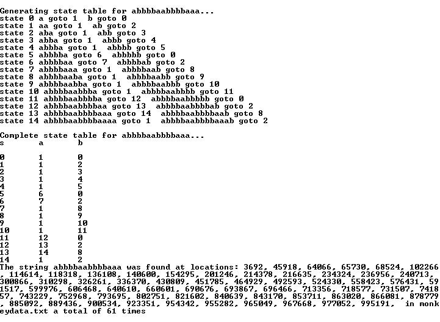

## State Machine for Efficent string searches

Takes a search string consisting of a's and b's and creates a state machine that can search through a file and find every occurrence including overlaps. This results in a fast, efficient search that compares each character in the file only one time. Test files included.

